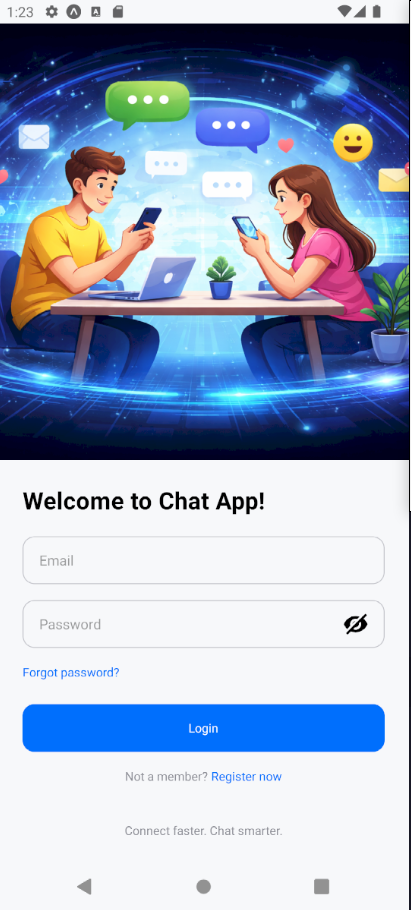
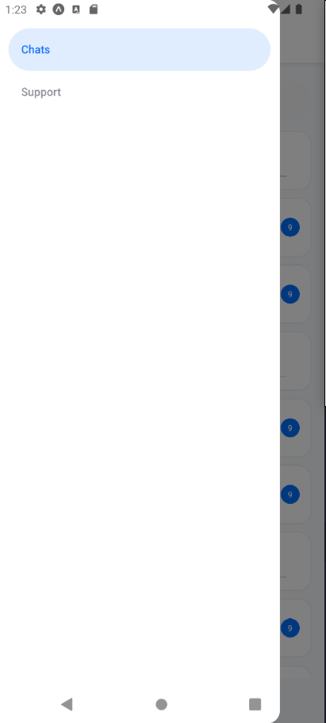
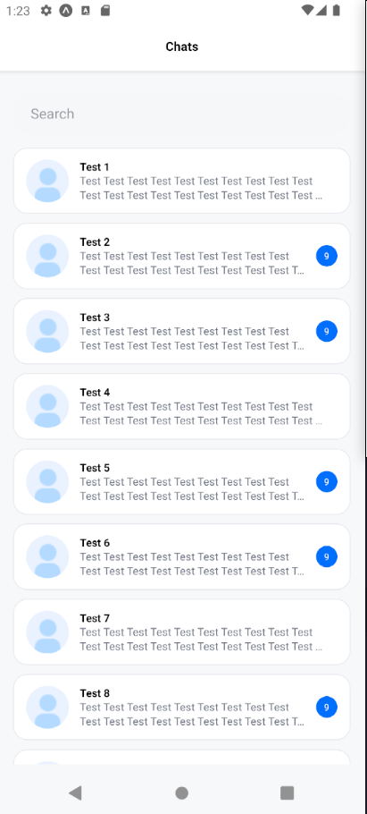
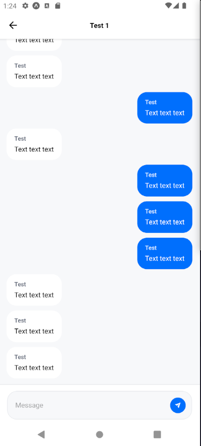

# GoIT Mobile Design 7

## Scripts

```sh
npm run storybook
npm run ios
npm run android
```

## Navigation Structure

- Stack Navigation:
  - RootStack: Login -> AppDrawer.
  - ChatsStack: ChatsList -> Chat (chat screen).
- Drawer Navigation:
  - Drawer: Chats (ChatsStack), Support (placeholder).

## Screen Relations
- Login -> AppDrawer (after pressing Login).
- ChatsList -> Chat (open a specific chat).

## Screen Params
- Chat: { chatId, username } to render the header and chat data.

## Screenshots

<table>
  <tr>
    <th align="center">Login Screen</th>
  </tr>
  <tr>
    <td align="center"></td>
  </tr>
  <tr>
    <th align="center">Drawer</th>
  </tr>
  <tr>
    <td align="center"></td>
  </tr>
  <tr>
    <th align="center">Chats List</th>
  </tr>
  <tr>
    <td align="center"></td>
  </tr>
  <tr>
    <th align="center">Chat</th>
  </tr>
  <tr>
    <td align="center"></td>
  </tr>
</table>
